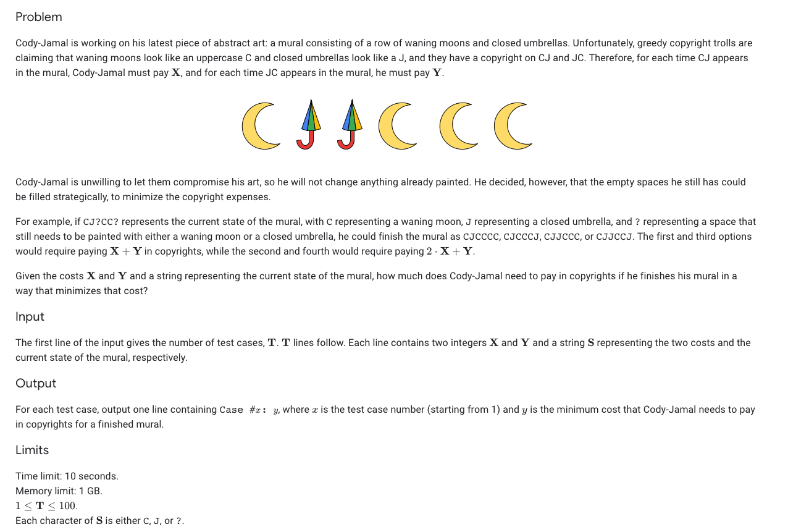

### Problem Statement

### Analysis
Pretty ugly solution as I was running out of time at this point. I found a greedy solution which unfortunately did not work for the extra credit test set which required a dynamic programming solution. The idea behind my solution is CC and JJ combinations result in no fine being paid so C?C and J?J sequences can essentially be thrown out. If we encounter a ? then we just insert whichever letter appears most immediately after the ? to minimize number of fines payed, because if the opposite letter appears later in the array we would have to pay the fine anyways. Summing up the cost is as simple as iterating through and counting the number of times the sequence switches from C->J or J->C and adding the respectives costs to the total. Having taken courses on dynamic programming I believe I definitely could have come up with the third test set solution as it is a pretty simple optimization problem.

Because we are just iterating the runtime is roughly O(length of the sequence). 