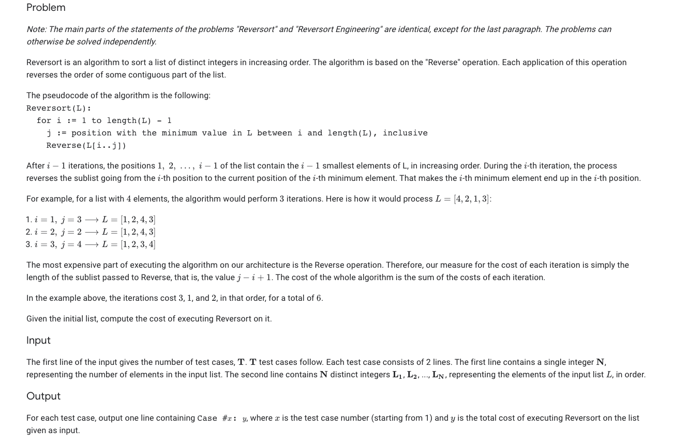

### Problem Statement

### Analysis
This is a fairly easy problem. We know that the list will contain values 1:n and that 1 should be in the first position, 2 should be in the second, etc. We can iteration from 1 to n, moving through the indices in the array and simply swap the positions of elements if we find they are in the wrong place. For the total cost of sorting we just use the indices we are on in each iteration and plug them into the cost function given in the problem statement.

This would run in O(n^2) time because we iterate through (n) and on each iteration must iterate again (n) to find the index of the desired value.