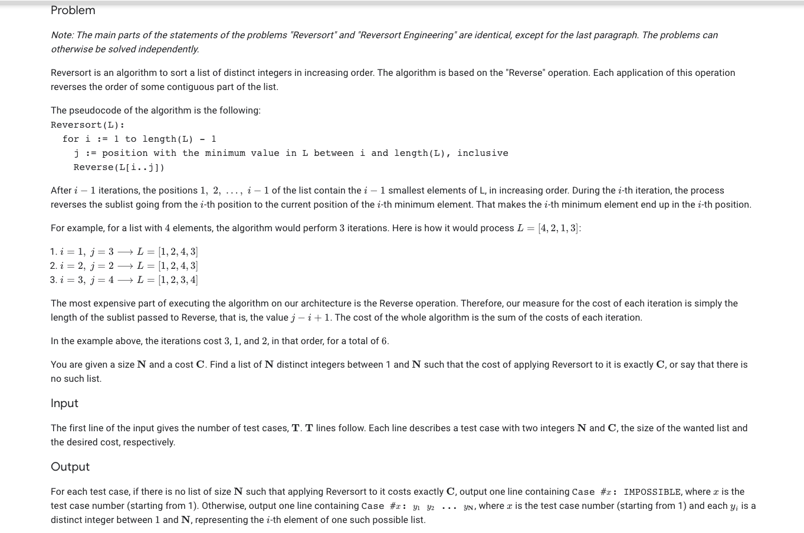

### Problem Statement

### Analysis
As said in the problem statement, this question identical to the reversort problem, but we are to construct a list with a specific cost of sorting or print IMPOSSIBLE if such a list does not exist. The first thing to note is that there is a range of costs possible for a given size. If the requested cost is not in the that range we can immediately conclude it is not a possible problem. My solution was to recursively swap values in the list until the cost was reached.