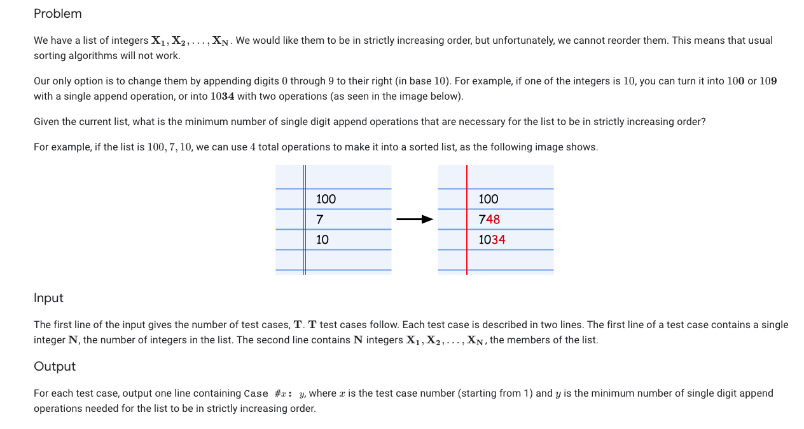

### Problem Statement

### Analysis
Passing the first test case in this problem is pretty simple. While the current number we are on is not greater than the number directly before it we multiply by 10 and check to see if it is greater again. This essentially appends a 0 to the number. At this point we check the difference between numbers to see if appending a 1:9 would also yield a greater number as to not multiply by 10 too many times. This naive approach solved test set 1 for me but failed on more difficult problems in test set 2. The issue with that solution is when we encounter a pair of numbers like [788,7]. The naive solution would yield [788, 7000] taking 3 append operations when [788,790] takes only 2. I solved this issue by first multiplying by 10 until the second number is greater, then dividing by 10 and seeing if (current number)+10^(number of iterations -1) -1 is greater than the previous number. If this inequality is true it means that instead of multiplying by 10 an additional time we can just increment our current number to be one greater than the previous number to keep the current number as low as possible.

The runtime for this solution varies pretty heavily as the number of iterations is linear with respect to the input but would be polynomial with in the length of numbers in the input. The runtime additionally depends on the differences between numbers in the array (Ex: [1,1*10^100] takes many more iterations than [1*10^900,1*10^950])
