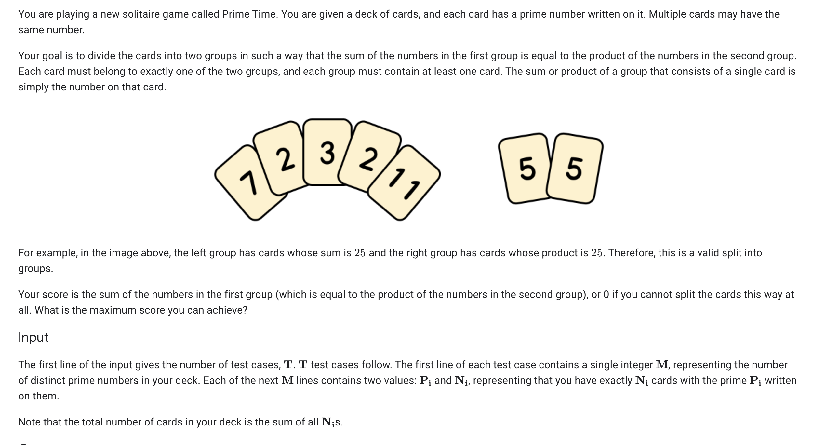

### Problem Statement

### Analysis
The first thing to note for this problem is that it is extremely unlikely that it is extremely unlikely that a polynomial time algorithm exists (Could reduce to a pretty similar problem from subset sum which is NP-complete). This told me that I probably wouldn't be able to find a "rule" or something that would make the problem easy. This led me to treating this like a bruteforce optimization problem. We can immediately note that the product partition has a much larger range than the sum partition. Knowing this, we can upper bound the product partition to be < the sum of all numbers given. We could likely find a much tighter bound but this seemed to be good enough for me. Using this bound we can iterate decreasingly (because we want the maximum number) from the bound to 2. At each number I find the prime factors (if they exist) and if the sum of all numbers given - sum of the factors = the current number then we have a potential solution. At this point I check to see if the prime factors exist in the given set of numbers in the correct quantities. If so, this is the maximal solution.

My solution passes the second test set (<100 cards) but exceeds the time limit in the set with <10^15 cards. I tried to further optimize my solution by discarding prime factorizations including numbers >499 (the maximum number in any test set, given in problem statement) but this was inadequate. I believe the solution to this test set involves finding some tighter bound on the size of the product partition but I was happy with passing the first 2 sets here.